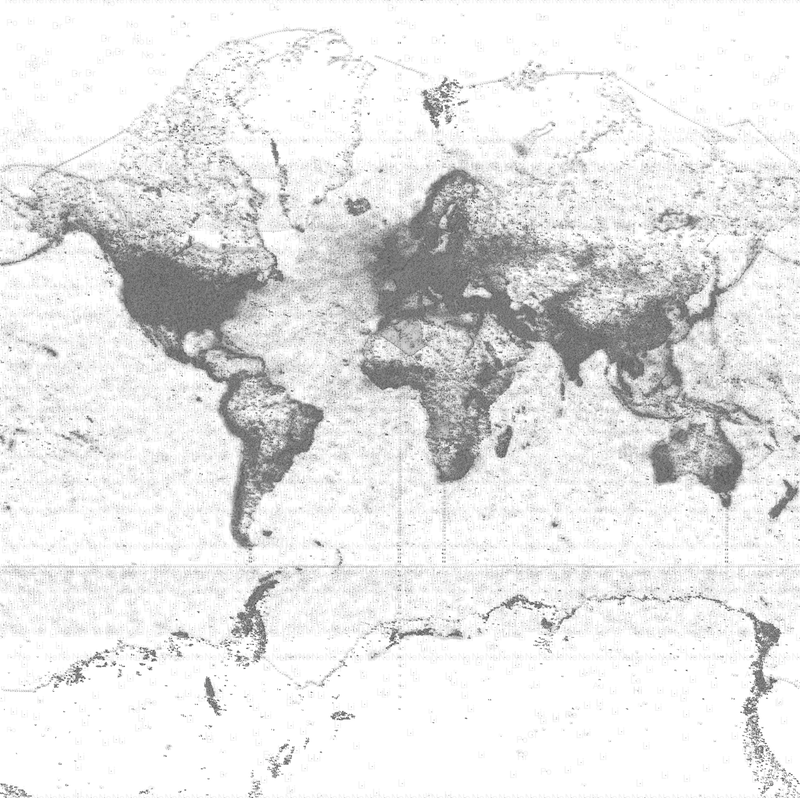

# geo_qt #
The repository consists of a toolkit for creating geo-data inspired artworks to accompany the AHRC funded [Digital Realism](http://digital-realism.net) project.

The geo_qt package is a collection of mapping tools for rendering large scale images and animations. It has been designed as a lightweight framework that can easily be extended to create interactive rendering tools. The GUI and the map interface are based on the Python PySide library. 

Typically a map would be generated by specifying the map layers and data sources in a config file, overriding the map layer class rendering, and extending the GUI controls to interactively style the map. 

### License ###

Licensed under [GPLv3](https://www.gnu.org/copyleft/gpl.html).

### Setup ###

The project was developed using [Enthought Canopy](https://www.enthought.com/products/canopy/) under Python 2.7.6.  
Dependencies were installed via the Canopy package manager:

future==0.14.3  
numpy==1.8.1  
PIL=1.5.6  
pyproj==1.9.3  
PySide==1.2.2  
Qt==4.8.5  

Optional  
ModestMaps==1.4.1  
basemap==1.0.7  

### Authors ###

Gavin Baily developed the geo_qt package  
Stefano De Sabbata developed the WMF Lab tool for capturing geo-coded Wikipedia article metadata

### Project team ###

Principal Investigator: Tom Corby, CREAM, University of Westminster  
Researcher: Gavin Baily, CREAM, University of Westminster and Tracemedia  
Researcher: Stefano De Sabbata, Oxford Internet Institute, University of Oxford  

